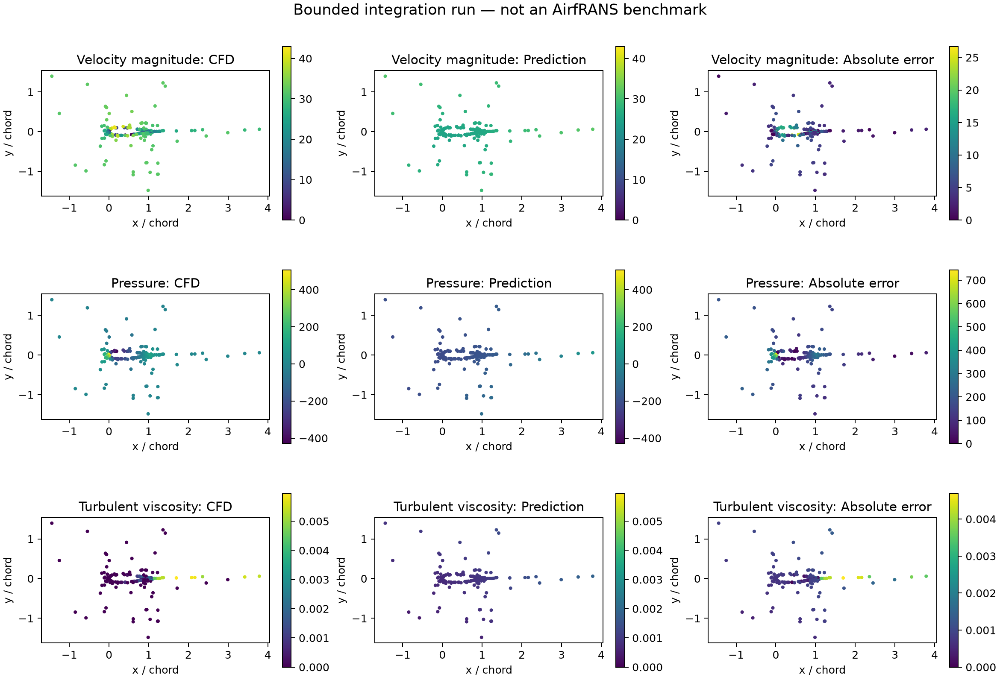
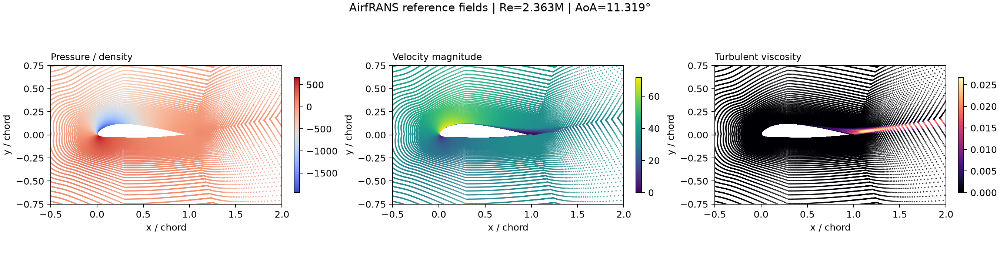

# AIRFAANS

[Portfolio case study](https://triasha72.github.io/Portfolio/case-airfaans.html)

AIRFAANS is my study of learned surrogates for aerodynamic CFD. Given an airfoil
mesh and its operating conditions, the model predicts the flow field and the
forces an engineer would use to compare designs.

**Coursework project for AE 6394 at the Georgia Institute of Technology.**
The repository documents the implementation and evidence produced for the
project; it does not imply endorsement by Georgia Tech or the AirfRANS authors.

This began as coursework and grew into a reproducible comparison of three model
families. Every reported model result uses the official public AirfRANS data.
The small analytic fixture in CI checks that the software runs; it is not
presented as aerodynamic evidence.

The useful question is not simply whether a model interpolates familiar cases.
It is whether the model holds up at new Reynolds numbers and angles of attack,
preserves lift and drag well enough to be informative, and becomes more
uncertain when it leaves the conditions seen in training. Those harder checks
are the focus of the remaining work.

## Project story

**Situation.** High-fidelity CFD is valuable during aircraft design, but running
it for every candidate is expensive. A learned surrogate can shorten that loop,
provided it does not hide poor force predictions or failure outside the training
range.

**Task.** I wanted a fair comparison of geometry-aware models on the official
AirfRANS benchmark, using the complete meshes and the engineering quantities a
designer would inspect.

**Action.** I implemented a pointwise MLP, a MeshGraphNet-style model, and a
point neural operator behind one data and evaluation contract. The experiment
uses train-only normalization, validation-selected checkpoints, three matched
seeds, all 200 interpolation test meshes, and force calculations checked against
the official AirfRANS implementation. I then added ensemble uncertainty and
active-learning evaluation for the OOD phase.

**Result.** No model dominated every output. At seed 17, MeshGraphNet gave the
lowest pressure relative L2 (`0.8261`) and drag-coefficient MAE (`0.3012`),
while the MLP led velocity-x (`0.3904`), velocity-y (`0.7091`), and lift MAE
(`0.2932`). That trade-off is more useful than naming one universal winner. OOD
and uncertainty runs remain open and are labeled that way.

AIRFAANS takes an airfoil mesh, freestream condition, Reynolds number, and angle
of attack and predicts four values at every mesh node:

```text
(geometry, Re, angle of attack) -> (velocity_x, velocity_y, pressure, turbulent viscosity)
```

The project compares a pointwise MLP, a residual MeshGraphNet-style model, and a
global point operator. The evaluation contract covers interpolation, scarce-data
learning, Reynolds-number extrapolation, and angle-of-attack extrapolation. It
also checks whether predicted fields preserve pressure coefficient and integrated
lift and drag, whether ensemble uncertainty rises out of distribution, and
whether uncertainty-guided simulation selection beats random selection.

AIRFAANS is an independent project, not part of or endorsed by the AirfRANS
authors. AirfRANS data and model weights are not redistributed here.

## Current evidence

| Capability | Status | Evidence |
|---|---|---|
| Typed mesh/field representation | Implemented and tested | `src/airfaans/data.py` |
| Mesh-connectivity and k-NN graphs | Implemented and tested | `src/airfaans/graph.py` |
| Pointwise MLP | Implemented | `src/airfaans/models.py` |
| MeshGraphNet-style message passing | Implemented | `src/airfaans/models.py` |
| Irregular-point neural operator | Implemented | `src/airfaans/models.py` |
| Official VTK/PyVista ingestion | Measured on a real 181,794-node case | `artifacts/evaluation/airfrans_ingestion_v0_1.json` |
| Official task manifest | Frozen and validated for all 1,000 cases | `data/manifests/airfrans_tasks_v0_1.json` |
| Real-data optimization smoke | All three models reduced loss by 64–88% | `artifacts/evaluation/real_tiny_overfit_v0_1.json` |
| Multi-case experiment runner | Train-only normalization, sampling, validation, early stopping and best checkpoints | `src/airfaans/experiment.py` |
| Complete-pipeline coursework check | Real train/validation/test cases traversed the complete CPU workflow | `artifacts/evaluation/bounded_pipeline_v0_2/result.json` |
| Pressure + viscous force convention | Exact match to official AirfRANS implementation; five reference cases frozen | `artifacts/evaluation/airfrans_force_verification_v0_1.json` |
| MeshGraphNet interpolation measurement | 200/200 official test cases, full meshes, seed 17 | `artifacts/evaluation/mesh_graph_net_interpolation_seed17_50ep_summary.json` |
| Matched three-seed architecture comparison | Complete: 9 treatments × 200 official full meshes | `artifacts/evaluation/interpolation_three_seed_summary.json` |
| Scarce-data and OOD measurements | Pending GPU execution | `reports/airfrans_v0_1.md` |
| Ensemble UQ and active learning | Metrics/selection implemented; experiment pending | tests and config |
| Operational evidence gate | Implemented; currently rejects missing OOD/UQ/active-learning evidence | `artifacts/evaluation/operational_readiness_v1.json` |
| Optional demonstration interface | FastAPI and Docker exercise the checkpoint boundary; no production deployment is claimed | `/health`, `/v1/predict` |

The checked-in demo uses a deterministic analytic cylinder-like fixture. It
tests the pipeline in CI, but it is neither RANS CFD nor an AirfRANS result.

The real-data ingestion path has also been executed locally. One official
AirfRANS training simulation produced 181,794 nodes, 1,025 surface nodes, and a
724,640-edge mesh graph in 1.57 seconds on Apple Silicon. This is measured data
engineering evidence, not model-accuracy evidence.

A bounded 512-node CPU optimization check also passed for all three model
families. Over 100 steps, normalized training MSE fell by 64.4% for the MLP,
87.7% for MeshGraphNet, and 67.5% for the point operator. This confirms that the
real-data tensors, graph, gradients, and optimizers connect correctly; it is not
a held-out comparison and should not be presented as model quality.

The complete experiment command has also run across distinct real training,
validation, and test simulations. A deliberately small CPU treatment used two
training cases, one validation case, one protected test case, 256 nodes per
case, and three epochs. It created and reloaded a hashed best checkpoint, then
produced held-out field metrics and the diagnostic below. Its poor errors are
expected at this budget and demonstrate the evaluation boundary—not surrogate
performance.

The first official full-mesh GPU treatment is now complete. A 50-epoch,
seed-17 MeshGraphNet-style model selected a checkpoint at validation mean
relative L2 `0.60575`, then evaluated all 200 official interpolation test cases.
Mean test relative L2 was `0.40125` for velocity-x, `0.74875` for velocity-y,
`0.82612` for pressure, and `0.78855` for turbulent viscosity. Mean absolute
force-coefficient error was `0.30122` for drag and `0.52682` for lift. The
full-mesh evaluation took `1,121.88 s` on a Kaggle GPU session. Every case was
persisted separately before aggregation and tied to checkpoint SHA-256
`66e7b3bc19dc2a6582c80ddaab5a561d92029289d4d726fef6e24c01df140295`.
This was the first credible single-treatment result. The matched architecture
and seed evidence reported below now supersedes it for model comparison; OOD
tasks remain pending.

The matched 50-epoch, seed-17 architecture pass is now complete on all 200
official interpolation test meshes:

| Model | ux rel. L2 | uy rel. L2 | pressure rel. L2 | nu_t rel. L2 | CD MAE | CL MAE |
|---|---:|---:|---:|---:|---:|---:|
| Pointwise MLP | **0.3904** | **0.7091** | 0.9355 | 0.7888 | 0.3628 | **0.2932** |
| MeshGraphNet | 0.4013 | 0.7487 | **0.8261** | **0.7886** | **0.3012** | 0.5268 |
| Point neural operator | 0.4283 | 1.0443 | 1.2434 | 0.8018 | 0.3695 | 0.2959 |

At this budget, no architecture dominates every output: MeshGraphNet is best
on pressure, turbulent viscosity, and drag, while the pointwise MLP is best on
both velocity components and lift. The compact point operator trails the two
baselines. This table is retained as the seed-17 view; the completed three-seed
result below is the appropriate basis for the current ranking.

A second MeshGraphNet treatment (seed 29, the same 50-epoch contract) has also
completed all 200 official interpolation meshes. Relative L2 was `0.36349` for
velocity-x, `0.65474` for velocity-y, `0.71475` for pressure, and `0.64414` for
turbulent viscosity; drag and lift MAE were `0.21254` and `0.19944`. This is a
useful repeat but not yet the preregistered three-seed estimate. Its raw records
were checked in the live Kaggle session, and the durable compact summary is in
`artifacts/evaluation/mesh_graph_net_interpolation_seed29_50ep_summary.json`.

The seed-29 point neural operator is now complete under the same contract.
Relative L2 was `0.41084` for velocity-x, `1.03226` for velocity-y, `1.19613`
for pressure, and `0.80435` for turbulent viscosity; drag and lift MAE were
`0.32790` and `0.29857`. Together with the earlier seed-29 MLP and MeshGraphNet
runs, this completes the second matched architecture pass. Seed 41 remains
necessary before reporting three-seed means and variation.

The preregistered three-seed interpolation comparison is now complete. Values
below are mean ± sample standard deviation over seeds 17, 29, and 41; every
treatment used 50 epochs and all 200 official full-mesh test cases.

| Model | ux rel. L2 | uy rel. L2 | pressure rel. L2 | nu_t rel. L2 | CD MAE | CL MAE |
|---|---:|---:|---:|---:|---:|---:|
| Pointwise MLP | 0.3993 ± 0.0141 | 0.7242 ± 0.0230 | 0.9550 ± 0.0314 | 0.7979 ± 0.0219 | 0.3663 ± 0.0221 | 0.3546 ± 0.1460 |
| MeshGraphNet | **0.3788 ± 0.0199** | **0.6703 ± 0.0720** | **0.7693 ± 0.0557** | **0.6895 ± 0.0859** | **0.2319 ± 0.0619** | 0.3907 ± 0.1705 |
| Point neural operator | 0.4183 ± 0.0090 | 1.0314 ± 0.0133 | 1.2125 ± 0.0268 | 0.8127 ± 0.0167 | 0.3544 ± 0.0230 | **0.2843 ± 0.0225** |

MeshGraphNet has the lowest mean error for all four predicted fields and drag.
The compact point operator has the lowest mean lift error, so no architecture
wins every reported quantity. These conclusions apply only to this split,
budget, and implementation; OOD and scarce-data behavior remain separate
questions.





## Why AirfRANS

The [official AirfRANS library](https://github.com/Extrality/airfrans_lib)
provides 1,000 incompressible RANS simulations over NACA 4- and 5-digit
airfoils, with Reynolds numbers from 2 to 6 million and angles of attack from
-5 to 15 degrees. Its four tasks are `full`, `scarce`, `reynolds`, and `aoa`.
The documented nodal inputs include position, inlet velocity, signed distance,
surface membership, and normals; targets include velocity, pressure, and
turbulent viscosity. See the
[AirfRANS simulation reference](https://airfrans.readthedocs.io/en/latest/notes/simulation.html).

Graphs are useful because the CFD domain is irregular and resolution varies near
the airfoil. AIRFAANS represents each mesh node as a graph node, using either
solver connectivity or a controlled k-NN graph. Edge features are relative
coordinates and distance. The processor follows the encode-process-decode idea
introduced by [MeshGraphNets](https://arxiv.org/abs/2010.03409), while keeping
the implementation small enough to audit. PyTorch Geometric conversion is
provided for graph batching and interoperability with its documented
[message-passing interface](https://pytorch-geometric.readthedocs.io/en/latest/tutorial/create_gnn.html).

## Architecture

```text
AirfRANS / OpenFOAM VTK
          |
          v
PyVista field and mesh extraction -- Dask case-level preprocessing
          |
          v
typed FlowCase -> mesh or k-NN graph -> PyTorch Geometric Data
          |
          +---------+------------------+
          |         |                  |
          v         v                  v
   pointwise MLP  MeshGraphNet   point neural operator
          |         |                  |
          +---------+------------------+
                    |
                    v
     velocity, pressure, turbulent-viscosity fields
                    |
                    v
  field metrics | Cp/CL/CD | ensembles | OOD | active learning
                    |
                    v
     experiment artifacts + optional demo API
```

## Five-minute start

```bash
python -m venv .venv
source .venv/bin/activate
python -m pip install -e ".[dev]"
airfaans demo
pytest -q
```

The demo writes `artifacts/local/synthetic_demo.json` and a compressed flow case.
Its `evidence_label` is deliberately `analytic_fixture_not_airfrans`.

## Real AirfRANS setup

Install the complete environment:

```bash
python -m pip install -e ".[ml,airfrans,tracking,api,dev]"
python -m pip install airfrans
```

Download AirfRANS using its official package:

```python
import airfrans as af

af.dataset.download(root="data/raw/airfrans", unzip=True)
```

Do not commit the dataset. The downloaded processed archive was verified as
10,029,067,577 bytes with SHA-256
`6b301d75dee77fc6c7de6e551c44332be4acc84e30b253e9c60cfa756f6c96db`.
The checked-in manifest preserves this identity and the official task splits.
The AirfRANS adapter maps the actual `U`, `p`, `nut`, `implicit_distance`, and
`Normals` arrays and fails on missing fields rather than silently guessing.

## Experiments

The preregistration is `configs/experiment_v0_1.yaml`. Its comparison keeps
data, normalization, optimization, seeds, and evaluation cases fixed across:

1. Pointwise MLP: local node and operating-condition features, no connectivity.
2. MeshGraphNet: residual edge-to-node message passing over mesh or k-NN edges.
3. Point operator: global learned modes over the irregular point set.

Splits are made by simulation, never by randomly mixing nodes from one CFD case
across train and test. Reynolds and angle-of-attack OOD tasks hold out the upper
operating range. Results must include three seeds, per-field RMSE/MAE/relative
L2, CL/CD error, latency, memory, node/edge throughput, uncertainty-error
correlation, and the OOD/ID uncertainty ratio.

The complete manual run and publication gates are in
[`docs/real-data-runbook.md`](docs/real-data-runbook.md). Pending tables are in
[`reports/airfrans_v0_1.md`](reports/airfrans_v0_1.md).

Run a bounded complete-pipeline coursework check locally:

```bash
airfaans train \
  --dataset-root data/raw/airfrans/processed/Dataset \
  --model pointwise_mlp --task interpolation --seed 17 \
  --output-dir artifacts/local/bounded-run \
  --max-train-cases 2 --max-validation-cases 1 --max-test-cases 1 \
  --epochs 3 --nodes-per-case 256
```

Omit every case-count, epoch, and node-count override for a preregistered full
run. Normalization is fitted only on training simulations. Validation cases are
reserved deterministically from the official training list; the official test
list remains untouched.

## Optional demonstration API

This interface is included to demonstrate checkpoint loading and input
validation within the coursework repository. It is not presented as a hosted,
production-ready, or client-facing application.

```bash
python -m pip install -e ".[api]"
uvicorn airfaans.api:app --reload
curl http://localhost:8000/health
```

`/v1/predict` returns HTTP 503 until a trained, validated checkpoint and its
release manifest are wired to the predictor boundary. The release gate verifies
the checkpoint, official-split evaluation, dataset manifest, split isolation,
model configuration, and an explicitly approved validation-error ceiling before
loading any weights. Bounded runs and modified artifacts fail closed.

Configure checkpoint-backed inference with:

```bash
export AIRFAANS_CHECKPOINT=artifacts/local/interpolation-mesh-17/best.pt
export AIRFAANS_DATASET_ROOT=data/raw/airfrans/processed/Dataset
export AIRFAANS_RELEASE_MANIFEST=artifacts/releases/interpolation-mesh-17.json
uvicorn airfaans.api:app
```

The bounded checkpoint shown elsewhere in this repository is deliberately not
eligible for a release manifest. Validate an official candidate before startup:

```bash
airfaans validate-release \
  --release-manifest "$AIRFAANS_RELEASE_MANIFEST" \
  --checkpoint "$AIRFAANS_CHECKPOINT"
```

The endpoint predicts an indexed AirfRANS case and refuses Reynolds or angle
metadata that does not match it. Lift, drag, and uncertainty remain `null` until
viscous-force verification and an ensemble checkpoint are complete.

## Resumable official full-mesh evaluation

Full-mesh force evaluation is intentionally separated from training. Each case
is committed to disk as soon as it finishes, tagged with its official test index
and checkpoint SHA-256. This prevents a Kaggle session limit from invalidating a
multi-hour evaluation and makes mixed-checkpoint aggregation impossible.

Run consecutive shards (the example uses five cases per Kaggle session):

```bash
python -m airfaans.cli evaluate \
  --dataset-root "$AIRFRANS_DATASET_ROOT" \
  --checkpoint "$AIRFAANS_CHECKPOINT" \
  --output-dir results/mesh_graph_net-interpolation-seed17-50ep \
  --start 0 --count 5
```

Copy the raw `evaluation_cases/` directory to durable storage after every
session, then continue with `--start 5`, `--start 10`, and so on. Re-running a
shard is safe: completed case records are skipped unless `--no-resume` is used.
After every official test index is present, validate coverage and aggregate:

```bash
python -m airfaans.cli aggregate \
  --checkpoint "$AIRFAANS_CHECKPOINT" \
  --output-dir results/mesh_graph_net-interpolation-seed17-50ep
```

The aggregator refuses to write `result.json` if an index is missing or any case
was evaluated from a different checkpoint. Raw per-case JSON remains alongside
the aggregate; compression is optional and is never the sole evidence copy.

## OOD uncertainty and active-learning execution

The ensemble runner loads independently seeded real-AirfRANS checkpoints of the
same architecture, uses identical sampled nodes for every member, and records
per-case field error, ensemble uncertainty, and uncertainty-error correlation.
The same checkpoint ensemble can be evaluated on interpolation, Reynolds-OOD,
and AoA-OOD splits, preventing a separately trained OOD model from contaminating
the comparison.

```bash
airfaans evaluate-ensemble \
  --dataset-root "$AIRFRANS_DATASET_ROOT" \
  --checkpoint runs/seed17/best.pt --checkpoint runs/seed29/best.pt \
  --checkpoint runs/seed41/best.pt \
  --evaluation-task interpolation --output results/uq-id.json

airfaans evaluate-ensemble \
  --dataset-root "$AIRFRANS_DATASET_ROOT" \
  --checkpoint runs/seed17/best.pt --checkpoint runs/seed29/best.pt \
  --checkpoint runs/seed41/best.pt \
  --evaluation-task reynolds_ood --output results/uq-reynolds.json

airfaans compare-ood --id-report results/uq-id.json \
  --ood-report results/uq-reynolds.json --output results/uq-ratio.json
```

`build_acquisition_round` freezes equal-sized uncertainty and seeded-random
case selections from the same pool. Both arms must be retrained from scratch
under equal compute. These commands make the pending experiment executable;
they do not create OOD or active-learning claims until real checkpoint runs are
published.

## Scaling path

- Dask parallelizes independent VTK preprocessing tasks.
- PyG conversion supports graph mini-batching.
- Training supports CUDA AMP, gradient accumulation, checkpointing, and resume.
- The real run records node/edge counts, peak accelerator memory, training
  throughput, and per-case inference latency.
- DDP is a measured optional treatment, not a default requirement.

## Repository map

```text
configs/       frozen experiment contracts
docs/          architecture and real-data runbook
reports/       pending and measured experiment reports
src/airfaans/  data, graph, model, physics, UQ, training, API code
tests/         deterministic unit and integration tests
```

## Scope and limitations

- The analytic fixture exists for CI and API/data-contract development only.
- The point operator is a compact irregular-domain treatment, not a claim of
  reproducing FNO, GINO, or Transolver.
- Complete-mesh evaluation reproduces the official AirfRANS pressure and
  molecular-viscous force convention. Sampled-node runs deliberately omit
  coefficients because they cannot recover trustworthy wall gradients.
- Inference speedup versus CFD remains pending because solver wall time and model
  inference must be measured on named hardware.
- The project does not include production deployment, service-level objectives,
  user management, operational monitoring, or a sponsored-client deliverable.
- This work is identified as an AE 6394 coursework project. Georgia Tech and the
  AirfRANS authors do not maintain or endorse this repository.

## License

Code is MIT licensed. AirfRANS and OpenFOAM data remain governed by their own
licenses and source terms.
