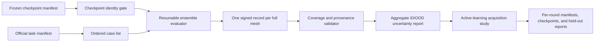

# AIRFAANS uncertainty and active-learning evidence runner

## Purpose

AIRFAANS already has trained Reynolds-OOD checkpoints, basic ensemble metrics,
and an active-learning prototype. The missing piece is a durable experiment
runner that turns those pieces into evidence that survives a notebook restart.

This work answers two narrow questions:

1. Does disagreement between ensemble members rise when prediction error rises
   or when a case is outside the interpolation distribution?
2. At the same labelling budget, does uncertainty-guided simulation selection
   outperform seeded random selection?

It does not claim that AIRFAANS is production-ready, that uncertainty is fully
calibrated, or that the results extend to 3-D CFD.

## Scope and order

The subsystem is implemented in two stages.

1. A resumable ensemble-evaluation runner evaluates frozen checkpoints on
   interpolation, Reynolds-OOD, and AoA-OOD tasks. The first executable
   treatment uses the existing seeds 29 and 41 as a two-member ensemble. A
   three-member run is allowed only after a compatible third checkpoint exists.
2. A matched active-learning runner compares uncertainty-guided acquisition with
   seeded random acquisition. Each arm starts with the same initial simulations,
   acquisition budget, model family, seed, and protected evaluation set.

Hardware profiling and the 3-D data/force extension are deliberately outside
this implementation. They consume this subsystem later.

## Architecture

### Checkpoint manifest

A manifest declares the model family, training task, distinct seeds, checkpoint
paths, SHA-256 values, and source configuration. The runner rejects a mixed
model, mixed training task, duplicate seed, missing file, or hash mismatch
before inference starts.

### Resumable ensemble evaluator

For every official case, the runner writes one JSON record atomically after
inference. Each record includes the official case index, case ID, task,
checkpoint-hash list, field metrics, lift/drag metrics when available, mean
ensemble uncertainty, and uncertainty/error correlation. Existing records are
validated and reused only when every identity field matches the current run.

The aggregate report is written only after the exact expected case coverage is
present. It reports mean field and force errors, mean uncertainty, uncertainty
versus error correlation, and the OOD-to-ID uncertainty ratio. The report states
the ensemble size and never labels a two-member ensemble as a broad calibration
study.

### Active-learning runner

An active-learning round receives a fixed candidate pool, starting simulation
set, protected evaluation manifest, acquisition budget, and seed. It writes:

- the initial and acquired simulation IDs;
- the uncertainty score or random draw used for every selection;
- the arm name, seed, budget, and checkpoint identity;
- the held-out result after each round.

The random arm uses a deterministic seed and must select from the same remaining
candidate pool as the uncertainty arm. Neither arm may inspect protected
evaluation cases during acquisition.

## Failure handling

- A restart resumes from validated per-case or per-round records, never from
  notebook output.
- Malformed, duplicate, stale, or mixed-provenance records stop the run with a
  clear error rather than being silently replaced.
- A partial run is labelled `in_progress`; it cannot produce a summary presented
  as complete.
- If a GPU is unavailable, manifest validation and bounded CPU fixture tests
  still run. No synthetic or sampled result substitutes for a full-mesh study.

## Testing

Unit tests will cover checkpoint-manifest validation, record reuse, rejection of
mixed or duplicate records, complete-coverage aggregation, deterministic random
acquisition, equal candidate pools, and protected-evaluation separation.

An integration test will use a tiny synthetic fixture to exercise interruption
and resume. It validates file contracts only; it does not create a scientific
result.

## Acceptance criteria

The implementation is ready for a real GPU run when:

1. tests cover the failure cases above;
2. a bounded interruption-and-resume test reaches exact complete coverage;
3. each completed report contains checkpoint hashes, case counts, task manifest
   identity, and source configuration;
4. the active-learning arms are reproducible from their saved manifests; and
5. public documentation distinguishes implemented infrastructure from measured
   results.

The research question is answered only after full official GPU runs meet these
criteria and their raw records are preserved.
